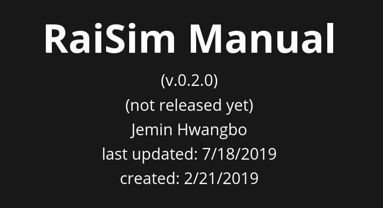

# RAISIM, A PHYSICS ENGINE FOR ROBOTICS AND AI RESEARCH

## License
You must read the [LICENSE](LICENSE.md) before using this software

## Requirements
- Linux only. support ubuntu 16.04 and 18.04 but might work on other distributions
- g++, gcc > 6 ([how to install?](https://github.com/jhwangbo/raisimHelp/tree/master#how-to-install-latest-version-of-g))
- cmake > 3.10 ([how to install?](https://github.com/jhwangbo/raisimHelp/tree/master#how-to-install-cmake))

## What is raisim/raisimLib?
Raisim is a physics engine for rigid-body dynamics simulation. Although it is a general physics engine, it has been mainly used/tested for robotics and reinforcement learning so far. It features an efficient implementation of recursive algorithms for articulated system dynamics (Recursive Newton-Euler and Composite Rigid Body Algorithm). RaisimLib is an exported cmake package of raisim.
 
## Install

Please install/save everything locally to prevent any conflicts with other libraries. We will assume that you have a single workspace where you save all repos related to raisim. Here we introduce two variables

- WORKSPACE: workspace where you clone your git repos
- LOCAL_BUILD: build directory where you install exported cmake libraries

### Dependencies
raisim depends on the two open-source libraries

- eigen (sudo apt-get install libeigen3-dev)
- png (included in raisim. Automatically installed if you install raisim) 

### raisim
Installing raisim is trivial. Just copy paste ```lib``` and ```include``` to LOCAL_BUILD, or you can use cmake. 
Assuming that you have cloned this repo, 

```commandline
cd $WORKSPACE/raisimLib
mkdir build && cd build && cmake .. -DCMAKE_INSTALL_PREFIX=$LOCAL_BUILD && make install
```

## Documentation
A short manual can be found here

[](https://slides.com/jeminhwangbo/raisim-manual)

## How to link?
raisimLib is a cmake package. In your project CMakeList.txt,

```commandline
find_package(raisim CONFIG REQUIRED)
target_link_library(YOUR_APP raisim::raisim)
```

When you run cmake of your project, let cmake know where raisim is installed, e.g.,

```commandline
cmake .. -DCMAKE_PREFIX_PATH=LOCAL_BUILD
```

## Performance benchmark
please refer to https://leggedrobotics.github.io/SimBenchmark/

## Short example
The following code creates raisim::World and simulates a robot, a ball and a flat terrain.
```cpp
#include “raisim/World.hpp”

int main() {
    raisim::World world;
    auto anymal = world.addArticulatedSystem(“pathToURDF”); // initialized to zero angles and identity orientation. Use setState() for a specific initial condition
    auto ball = world.addSphere(1, 1); // radius and mass
    auto ground = world.addGround();
    
    world.setTimeStep(0.002);
    world.integrate();
}
```

## Related repos
- raisimOgre: a visualizer for raisim, https://github.com/leggedrobotics/raisimOgre
- raisimGym: RL examples using raisim, https://github.com/jhwangbo/raisimGym

## Examples

### Simulation exapmles
These example videos are generated with raisimOgre (https://github.com/leggedrobotics/raisimOgre)


### Reinforcement learning examples
The policy is trained with raisimGym (https://github.com/leggedrobotics/raisimGym)


## Who made raisim?
Jemin Hwangbo (Robotic Systems Lab, ETH Zurich) is developing and managing raisim with the help from the following contributors:

- Donho Kang, Robotic Systems Lab, ETH Zurich
- Joonho Lee, Robotic Systems Lab, ETH Zurich

## Contact us
For bug reports/feature requests/instructions, use github issues.
For private inquiries, please contact us at info.raisim@gmail.com.

## How to post github issue
Please, whenever possible, include a standalone executable (which depends only on raisim and raisimOgre) reproducing the issue.

## Modeling tips

### URDF
- Ensure that your URDF file does not have unrealistic internal collisions.
- Use raisimOgre to visually inspect your URDF before simulating it (setting the simulation to the manual stepping mode helps). Check if the number of internal collisions in the nominal configuration is zero.

### ERP
- Raisim adds a spring element to mitigate numerical errors. If your system becomes unstable, it is most likely that it is due to the Error Reduction Parameter (ERP). You can set it using raisim::World::setERP()

## How to cite
The contact related algorithms are published in the below article 

```bibtex
@article{raisim,
  title={Per-contact iteration method for solving contact dynamics},
  author={Hwangbo, Jemin and Lee, Joonho and Hutter, Marco},
  journal={IEEE Robotics and Automation Letters},
  volume={3},
  number={2},
  pages={895--902},
  year={2018},
  publisher={IEEE}
}
```

## Created by

  


